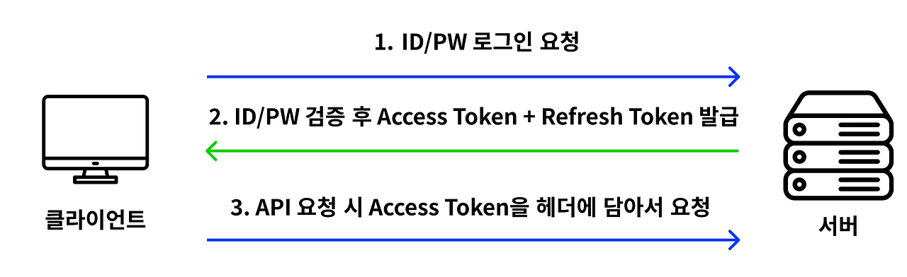
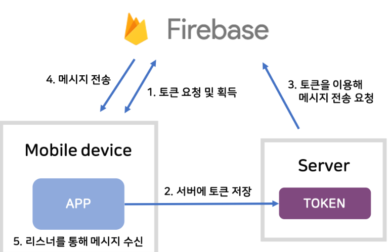
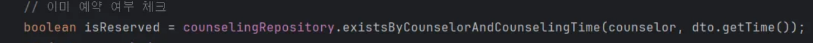
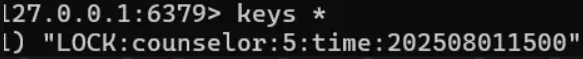
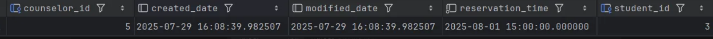
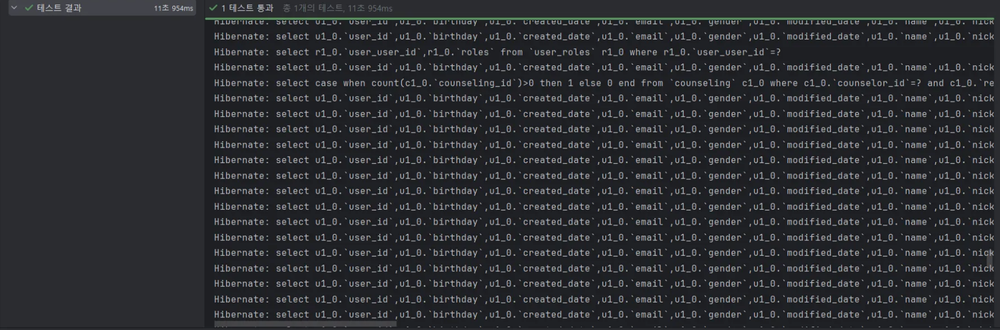

# 전재욱 TIL

## 2025-09-01
### 배운 내용
- CRUD 개발법 학습

## 2025-09-02
### 배운 내용
- SpringSecurity 학습 

JWT(Json Web Token)은 일반적으로 클라이언트와 서버 통신 시 권한 인가(Authorization)을 위해 사용하는 토큰이다.

기본 동작 원리는 간단하다.

1. 클라이언트에서 ID/PW를 통해 로그인을 요청하면

2. 서버에서 DB에 해당 ID/PW를 가진 User가 있다면, Access Token과 Refresh Token을 발급해준다.

3. 클라이언트는 발급받은 Access Token을 헤더에 담아서 서버가 허용한 API를 사용할 수 있게 된다.

여기서 Refresh Token은 새로운 Access Token을 발급하기 위한 토큰이다. 기본적으로 Access Token은 외부 유출 문제로 인해 유효기간을 짧게 설정하는데, 정상적인 클라이언트는 유효기간이 끝난 Access Token에 대해 Refresh Token을 사용하여 새로운 Access Token을 발급받을 수 있다. 따라서, Refresh Token의 유효기간은 Access Token의 유효기간보다 길게 설정해야 한다고 생각할 수 있다.

그런데, 만약 Refresh Token이 유출되어서 다른 사용자가 이를 통해 새로운 Access Token을 발급받았다면?
이 경우, Access Token의 충돌이 발생하기 때문에, 서버측에서는 두 토큰을 모두 폐기시켜야 한다. 국제 인터넷 표준화 기구(IETF)에서는 이를 방지하기 위해 Refresh Token도 Access Token과 같은 유효 기간을 가지도록 하여, 사용자가 한 번 Refresh Token으로 Access Token을 발급 받았으면, Refresh Token도 다시 발급 받도록 하는 것을 권장하고 있다.

## 2025-09-03
### 오늘 한 일
FCM

1) 먼저 저기서 얘기하는 토큰이란 Client App을 켜면 각각의 Client App을 구분하는 Token 을 의미한다. 어떤 디바이스에 정보를 보낼지 구분하는 토큰이라고 한다. 클라이언트는 그 토큰을 Firebase 로부터 발급받아서

2) 클라이언트는 그 토큰을 서버에 DTO를 통하던가 어떻게든 전달을 한다.

3)서버는 DB에 저장을 하든 Redis를 통해 저장을 하든 Member에 칼럼을 두든 어떻게든 저장을 한다.

4)메시지를 전달해야 하는 상황이 오면 서버는 Token을 이용해 Message를 만들어 Firebase에 전달한다.

5)그럼 이게 정상 Token인지 Firebase가 판단한 후 맞으면 모바일 디바이스에 메시지를 전달하는 식이다.

### 느낀 점 / 회고
- SSE를 구현하는 방법보다 훨씬 간편하고 유용하다

## 2025-09-04
### 오늘 한 일
동시성 제어

상담 예약하기를 할 때
예를 들어서 동시에 100명의 학생이 1명의 상담사에게 예약하기를 눌렀다고 해보자

그럼 다음과 같이 1개의 예약에 3명의 인원이 예약하기가 된다 

물론 코드내에서도 예약된 상담사는 예약이 안되게 했지만 예약이 겹치는 문제가 있다
이게 동시성 문제이다 이 문제를 반드시 해결해 줘야한다

분산큐는 redis의 pub/sub(?) 느낌으로 해당 키가 있으면 -> 다른방법도 있음 DB를 이용한 방법과 Lettuce(스핀들 문제가 발생함) 이 있음

해당 테이블의 동일한 값을 추가할 수 없게 된다

redis를 사용한 이유는 속도측면에서도 빠르고 Scale-out시에도 활용할 수 있기 때문에 사용했다

이로서 동시성 제어를 통해 1개의 데이터만 저장되게 된다

테스트 코드를 통해 검증도 완료했다

### 느낀 점 / 회고
- 실제 서비스를 진행할때 반드시 적용시켜줘야 할 것 같다
- 

## 2025-09-05
### 오늘 한 일
- 
- 

### 느낀 점 / 회고
- 
- 